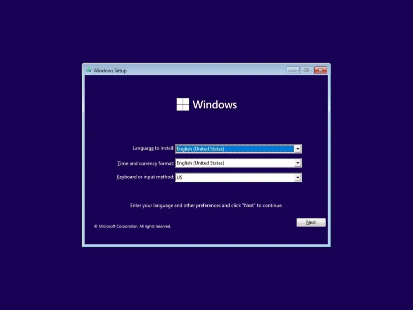

    <h1 style="font-size: 34px;">Instalar Windows11</h1>
    

        
    

O DEM tem acesso a uma Licença Windows fornecida pela Microsoft, esta é destinada aos computadores do departamento, no entanto, os administradores ao instalar a licença devem garantir que registam o propósito e/ou o computador em que foi feito. Porque é preciso enviar este registo de volta para a microsoft periodicamente.

Existe uma pen onde está o setup do Windows11 e depois é só escrever a licença para começar a instalação.

 
 
 
 

<ul size="10px">
    <li>Selecionar windows11_x64</li>
     
    <li>Selecionar o disco HDD ou SSD onde instalar o windows</li>
     
    <li>Selecionar a linguagem correta.</li>
</ul>

 
 
 
 
 

O download deve começar automaticamente depois dos passos listados (deve-se verificar que o download foi realizado com sucesso).
