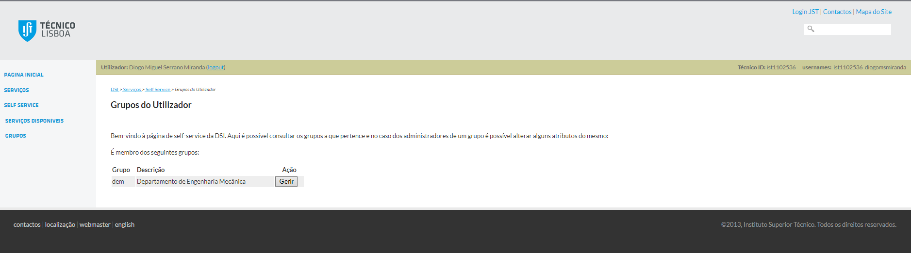
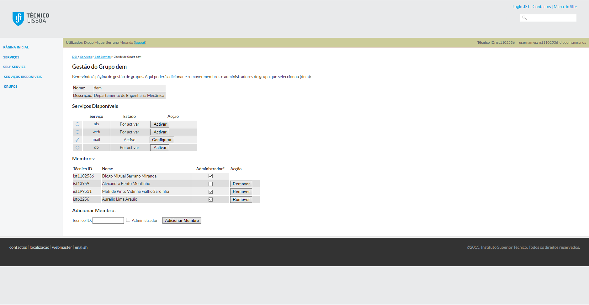
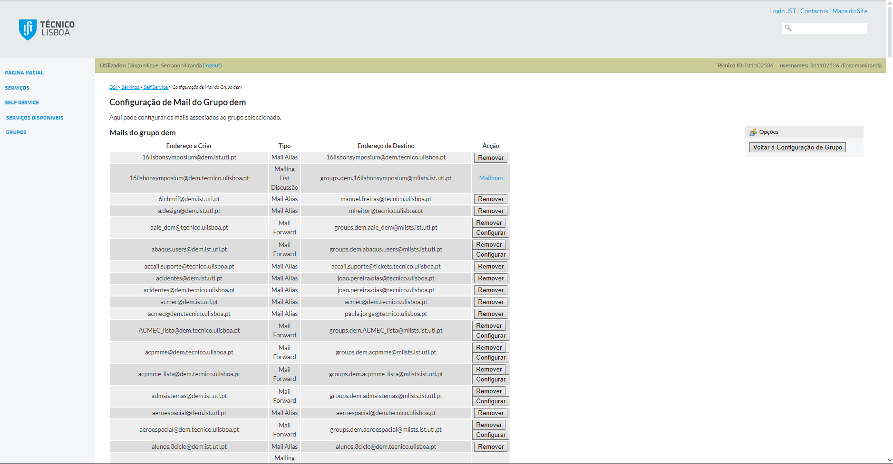

    <h1 style="font-size: 34px;">Mailing Lists</h1>
    

        
    

Mailing Lists is where all the configuration related to emails and webmail mailing groups is done.

The mailing lists can be accessed from this address:

https://selfservice.dsi.tecnico.ulisboa.pt/show_groups.php

Clicking on "Configure" ("Configurar")

Here, besides being the access point for the mailing lists, you can also define the administration (who administrates) these lists. To access the "mailman" where the email configuration is done, click on configure next to "mail."

Most of the pages from here on are quite intuitive. To add or remove a member from a specific email, click on configure, then add in bulk or remove individually/in bulk as needed.

However, in certain addresses, there is an additional platform where the administration can be done, called "mailman."

This platform serves the same purpose as the previous page, where the main function is to consult the member list and add/remove a member. Credentials are required to access this platform.

## Common Requests

Common Requests might envolve checking a list of members on a certain email, add a member or remove a member from a list.
These requests are usually made through the [OSTickets](../ostickets/README.md).

**You should always check to see if the person who sent the ticket has permissions to acess these information since it can be sensible one**

## Common Problems

##### Problem: Although address appears in the list of members it doesn't receive the emails from it.

##### Solution:

We removed and added the address to the list of members and it worked again.
